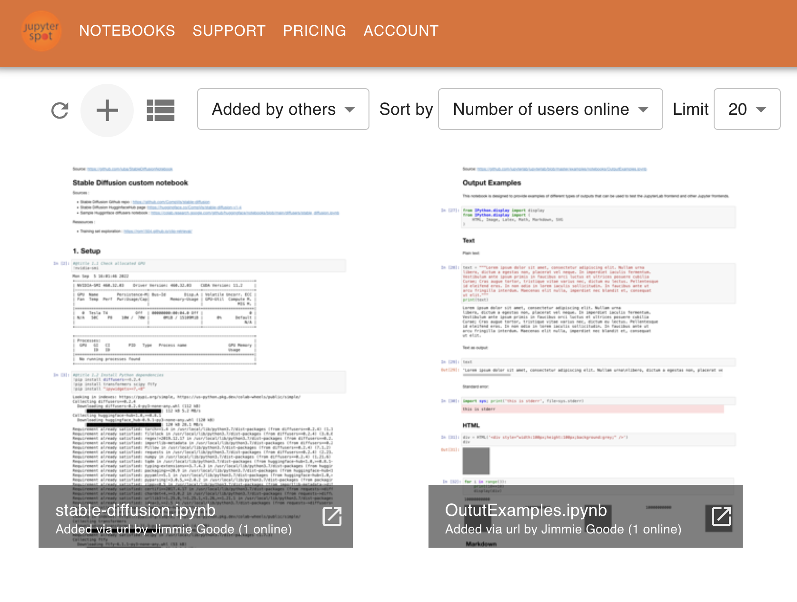
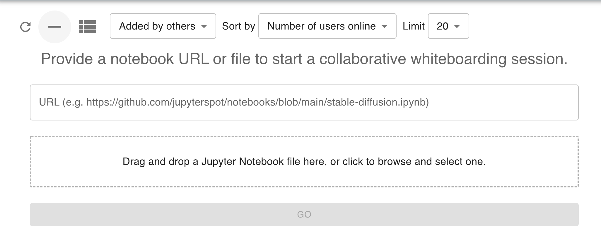
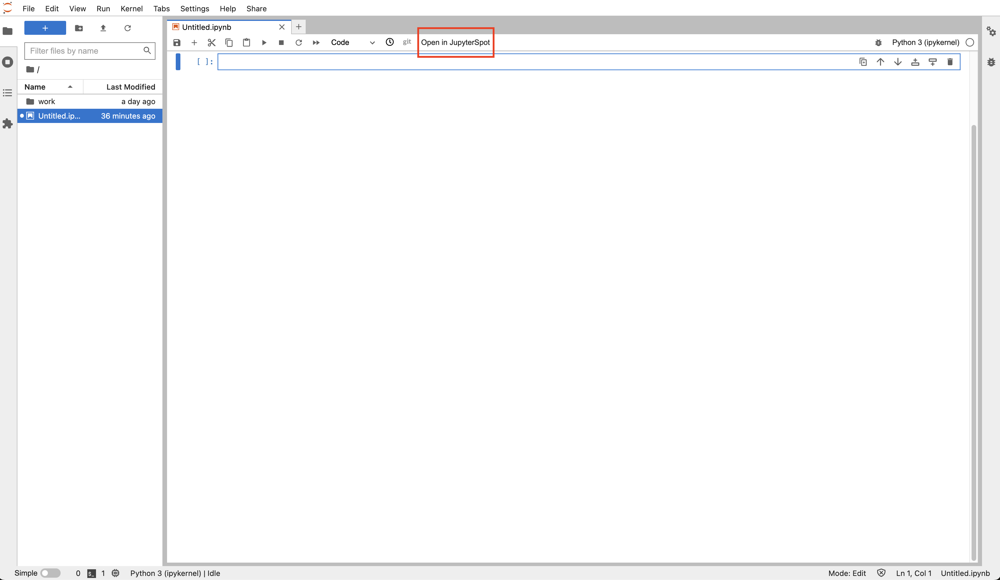
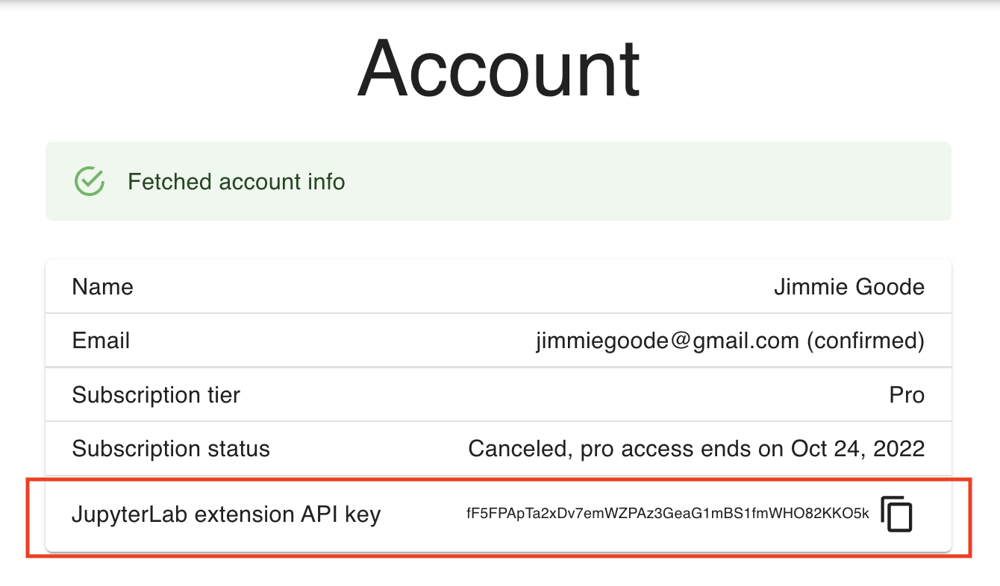
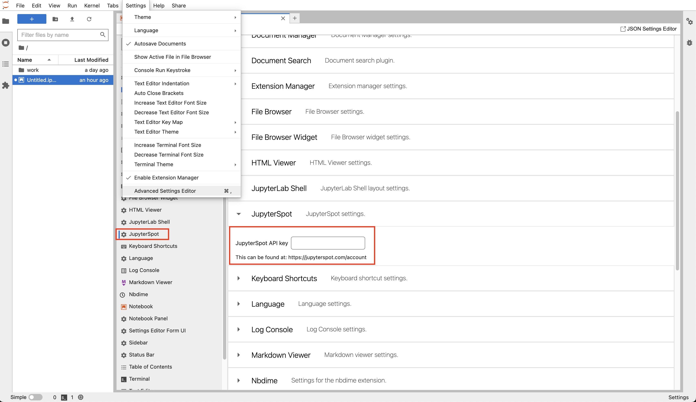
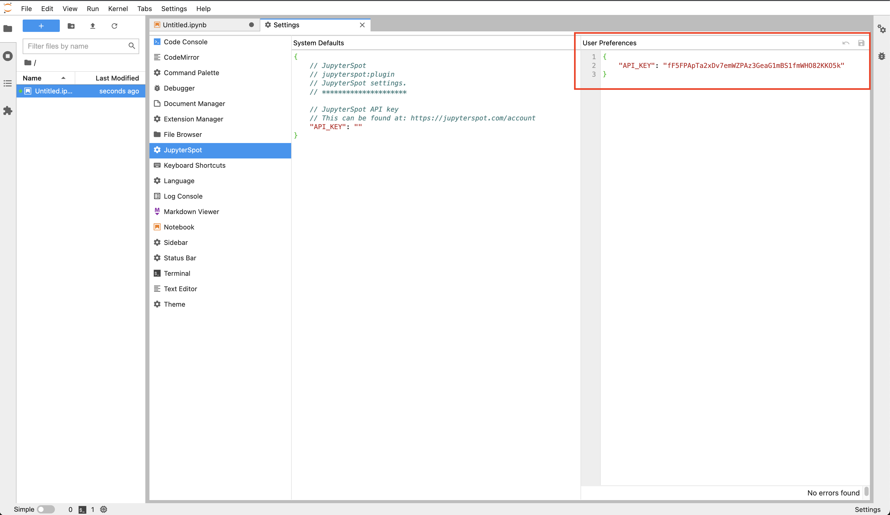
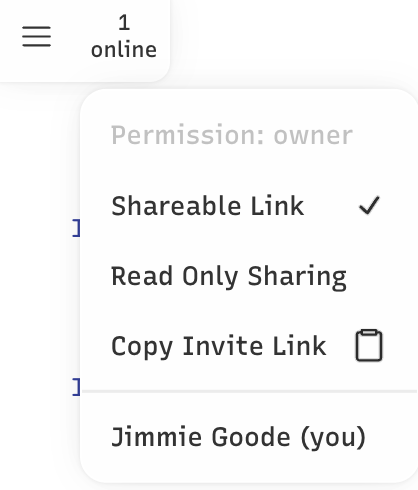

# Adding your first notebook

## Adding a notebook via URL

There are several ways to to add your notebook to JupyterSpot. If the notebook is available from a publicly visible URL, then there are two options:

1. Put the URL into the form at [https://jupyterspot.com/notebooks](https://jupyterspot.com/notebooks)
2. Visit `https://jupyterspot.com/notebook?url=YOUR_NB_URL`, where `YOUR_NB_URL` is the notebook's URL.

For option (1), first click the plus icon on the top left of the page. You'll then be presented with the following form:

<!--  -->



Enter the URL of your notebook into the form's box, then you'll be taken to your notebook's whiteboard.

### URL considerations

Note that URLs **must** point to a raw `.ipynb` file. For GitHub URLs, we automatically substitute `github.com` with `raw.githubusercontent.com` so that

```
https://github.com/jupyterspot/notebooks/blob/main/stable-diffusion.ipynb 
```

points to:

```
https://raw.githubusercontent.com.com/jupyterspot/notebooks/blob/main/stable-diffusion.ipynb.
```

If you're using an URL from BitBucket for example, make sure it points to the raw notebook JSON content and not a page showing a notebook viewer embedded in it.

## Adding a notebook via upload

You can also add a notebooks via uploading them through the same form. You can either drag and drop a notebook from Finder or Explorer into the outlined area or click the outlined area and browse to the location of the notebook on your filesystem. Only `.ipynb` files are accepted.

## Adding a notebook via JupyterLab extension

A thrid option is to use the [JupyterLab extension](https://github.com/jupyterspot/extension), which works with `JupyterLab >= 3.0`. To install it, run
```
pip install jupyterspot
```

This will add an "Open in JupyterSpot" button to the top menu bar when you have a notebook open:



After installing the extension, copy your API key from [the account page](https://jupyterspot.com/account):



Then in JupyterLab, add the key by going to Settings -> Advanced Settings Editor -> JupyterSpot. For newer versions of JupyterLab, this looks like:



For older versions of JupyterLab (~3.0), there will be a split pane of System Default and User Preferences, and you'll need to set your key in the right side User Preferences pane and save:



Once your API key is set, you can click the "Open in JupyterSpot" button while in any notebook to create a whiteboard on jupyterspot.com from your notebook's contents.

## Start collaborating

Once you've added a notebook, you can share its link with your colleagues so that they can join the whiteboarding session by clicking the "Copy Invite Link" in the upper left of the screen where the number of online users is shown:



As colleagues join, you'll see their names added and the online count will increase. 

Notebooks added by free accounts can be viewed from the [public notebooks page](https://jupyterspot.com/notebooks). Any drawings, text, and sticky notes added to such notebooks can be seen by everyone else. **Do not put any personal or proprietary information into these public notebooks!** If you need privacy, either [invite someone else](/sending-invites) to join JupyterSpot to get a private notebook, or check out [the pro plan](https://jupyterspot.com/pricing).

Notebook added by pro accounts do not appear on the list of public notebooks. Pro accounts can turn off the "Shareable Link" option shown above and toggle the "Read Only Sharing" option to restrict collaborators from editing.

<!-- All notebooks added via upload are private, meaning that **only those who have the link are able to view the notebook**. Think of your notebook as a Google Doc with access set to "Anyone with the link has access." -->

<!-- All notebooks added via URL are considered public, so any drawings, shapes, arrows, text, and sticky notes added to such notebooks can be seen by everyone else. **Do not put any personal or proprietary information into these public notebooks!** If you need privacy, you should use a private notebook via one of our [paid plans](https://jupyterspot.com/pricing). -->