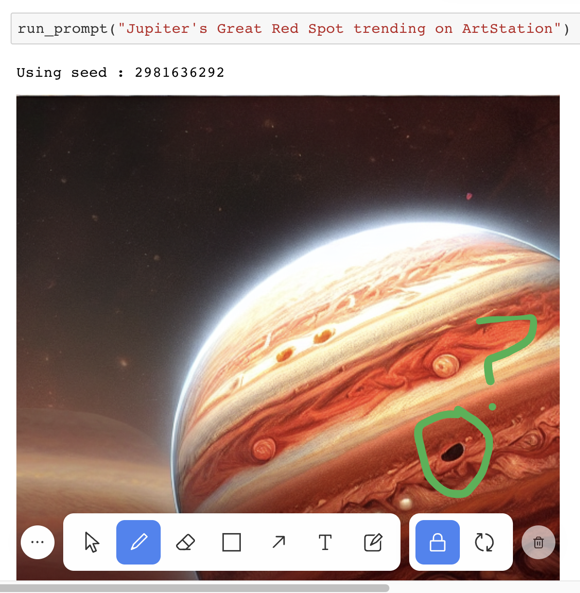
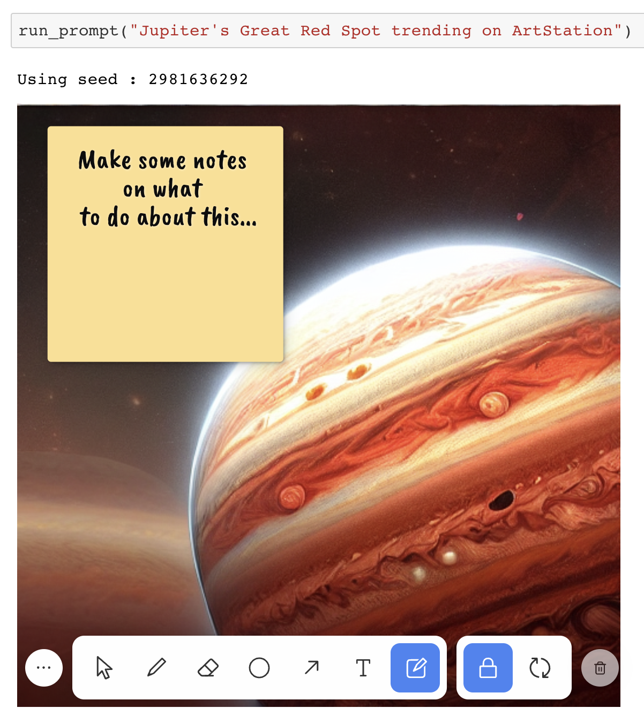

# Whiteboarding with your notebook

Talking about Jupyter data visualizations over Zoom can be difficult when you have no way of pointing directly to something on the screen. For example, it's often hard to verbally describe where on the plot an outlier is or where the seasonality is breaking down in a time-series.

## Tools

JupyterSpot gives you several tools for annotating your notebook that can help with this. All objects created by these tools sync in real-time so that you and your colleagues always see the same thing.

### Draw

Add free hand drawings.

### Select

Select anything and move it around.

### Shape

Add rectangles, ellipses, triangles, and lines.

### Arrow

Add arrows, connect shapes.

### Text

Add arbitrary text.

### Sticky note

Add sticky notes with text.

## Styles

The styles palette can be used to select options that apply to other tools, such as color, fill, texture, and size. It's accessible from the top right of your screen next to the undo and redo buttons and can be kept open by clicking "Keep Open".

## Preferences

The preferences menu is accessible from the upper left of the whiteboarding UI:

It allows you to make the following customizations:

1. Notebook in foreground (default `false`): setting this to `true` brings the notebook content to the foreground and pushes all drawings, shapes, text, and sticky notes to the background. This allows you to interact with any notebook content such as JavaScript plots, iFrames, video players, etc. **With this set to `true`, you won't be able to add any annotations since the canvas is positioned behind the notebook.**
2. Show Grid (default `false`): setting this to `true` displays a grid background on the canvas.
3. Dock Position (default: `bottom`): this lets you position the dock to either to top, bottom, left, or right.
4. Export Background (default: `transparent`) the background color to use when exporting drawings.
